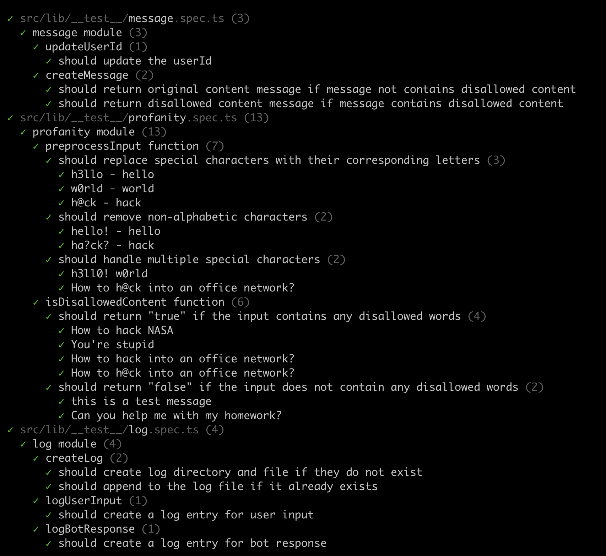
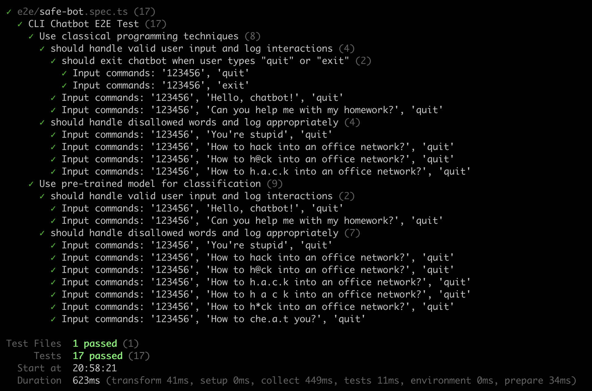
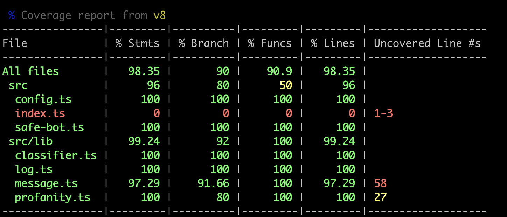

## Overview

Safe Chatbot is a Node.js-based chatbot application designed to filter out disallowed words from user input. It uses natural language processing (NLP) to detect and handle profanity and other disallowed content.

## Table Of Content

- [Overview](#overview)
- [Table Of Content](#table-of-content)
- [Libraries](#libraries)
- [Project Structure](#project-structure)
- [Configuration](#configuration)
- [Approach](#approach)
- [How to run](#how-to-run)
  - [Pre-requisites](#pre-requisites)
  - [Development](#development)
  - [Production](#production)
- [How to test](#how-to-test)
- [Contact](#contact)

## Libraries

- **Natural**: A general natural language facility for Node.js.
- **Vitest**: A testing framework for Node.js applications.
- **Typescript**.


## Project Structure

```
.
├── e2e/
│   └── safe-bot.spec.ts
└── src/
    ├── config.ts
    ├── index.ts
    ├── safe-bot.ts
    └── lib/
        ├── __test__/
        ├── classifier.ts
        ├── log.ts
        ├── message.ts
        └── profanity.ts
```

## Configuration

The chatbot can be configured using the config.ts file. The configuration options are as follows:

```typescript
const DEFAULT_DISALLOWED_WORDS = [...]; // Add disallowed words here

const DEFAULT_LOG_PATH = 'logs/chatbot_log.txt'; // Path to the log file
const IS_ENABLED_CLASSIFIER = false; // Enable or disable the pre-trained classifier

const BOT_MESSAGES = {...}; // Define the bot's messages here
```

## Approach

1. **Profanity Filter**:
- The chatbot uses a simple profanity filter to detect and handle disallowed words. The filter is based on a list of disallowed words defined in the configuration file.

2. **Pre-trained Classifier**:
- The chatbot can be configured to use a pre-trained classifier to detect disallowed content. The classifier uses Bayesian method to identify offensive, abusive, or sensitive content.

- It is disabled by default but can be enabled by setting the `IS_ENABLED_CLASSIFIER` configuration option to `true`.

3. **Pre-trained AI model**: Enhancing Chatbot with AI Model. See more details in the [Enhancing Chatbot with an AI Model](docs/enhancing-chatbot-with-ai-model.md).


## How to run

### Pre-requisites
- Node.js v18 or higher
- Yarn or npm

### Development

To start the chatbot in development mode with automatic restarts on file changes:

```
yarn start:dev
```

### Production

To build and start the chatbot in production mode:

```
yarn build

yarn start:prod
```

## How to test

To run the unit tests:

```
yarn test
```



To run end-to-end tests:

```
yarn test:e2e
```



To run tests with coverage:

```
yarn test:coverage
```




## Contact

Nguyen Van Duy

- Email: duyk16@gmail.com
- GitHub: duyk16
